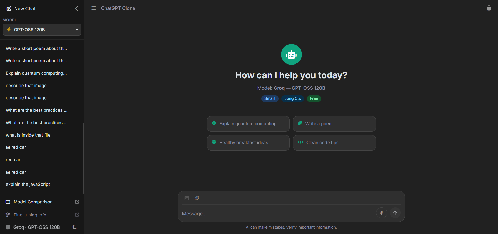
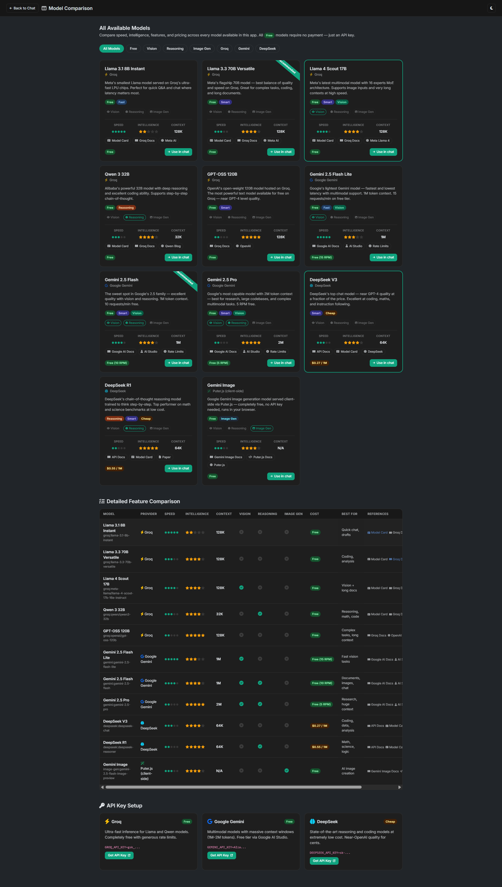

# ChatGPT Clone

> A fully featured, self-hosted ChatGPT-style web app — powered by **Groq** (free), **Google Gemini**, and **DeepSeek** — with real-time streaming, voice input, image generation, and a persistent SQLite chat history.


---

## Screenshots


### 💬 Chat Interface


Main chat UI with streaming responses, message controls, and clean layout.

---

### 🖼️ Chat with Image Description


Example of using image input and receiving AI-generated descriptions.

---

### ⚙️ Model Comparison Page


Side-by-side comparison of available AI models and their capabilities.
---

## ✨ Features

| Feature | Details |
|---|---|
| **Multi-provider AI** | Groq (Llama 4, Qwen 3, GPT-OSS), Google Gemini 2.5, DeepSeek V3/R1 |
| **Streaming responses** | Word-by-word streaming via Server-Sent Events |
| **Voice input (STT)** | Record audio → Whisper transcription via HuggingFace or Groq |
| **Image generation** | Free via Puter.js (Gemini Image model, no API key needed) |
| **Vision / file upload** | Attach images or text files to your message |
| **Persistent history** | All chats saved to a local SQLite database (`chat.db`) |
| **Re-generate** | Get a fresh AI response for any message |
| **Edit prompt** | Edit your last message and re-send |
| **Delete message** | Remove the last user + AI exchange |
| **Copy response** | One-click copy of any AI message |
| **Light / dark theme** | Toggle between themes, preference is saved |
| **Model comparison page** | `/models.html` — side-by-side comparison of all models |
| **Responsive design** | Works on desktop and mobile |

---

## 🛠 Tech Stack

**Backend**
- [Node.js](https://nodejs.org/) + [Express](https://expressjs.com/) — REST API & SSE streaming
- [better-sqlite3](https://github.com/WiseLibs/better-sqlite3) — synchronous SQLite for chat history
- [openai](https://www.npmjs.com/package/openai) — used for Groq & DeepSeek (OpenAI-compatible)
- [@google/generative-ai](https://www.npmjs.com/package/@google/generative-ai) — Gemini SDK

**Frontend**
- Vanilla JavaScript (no framework)
- [Bootstrap 5.3](https://getbootstrap.com/) — UI components
- [Font Awesome 6](https://fontawesome.com/) — icons
- [Google Fonts — Inter](https://fonts.google.com/specimen/Inter)
- [Puter.js](https://puter.com/) — client-side image generation (free, no key)
- Web Speech API — browser-native Text-to-Speech
- MediaRecorder API — audio capture for voice input

---

## 📋 Prerequisites

- **Node.js** v18 or newer — [download](https://nodejs.org/)
- **npm** (comes with Node.js)
- At least **one API key** (Groq is recommended — completely free)

---

## 🚀 Quick Start

```bash
# 1. Clone the repository
git clone https://github.com/YOUR_USERNAME/chatgpt-clone.git
cd chatgpt-clone

# 2. Install dependencies
npm install

# 3. Configure API keys
cp .env.example .env
# Open .env in your editor and add your keys (see section below)

# 4. Start the server
npm start
# → http://localhost:3000

# For development with auto-reload:
npm run dev
```

The first time the server starts it automatically creates `chat.db` — no database setup needed.

---

## 🔑 API Keys

All providers have free tiers. You only need **one** to get started.

### Groq ⚡ (Recommended — completely free)

1. Go to [console.groq.com/keys](https://console.groq.com/keys)
2. Sign up / log in
3. Click **"Create API Key"**
4. Copy the key → add to `.env`:
   ```
   GROQ_API_KEY=gsk_...
   ```

Models available: Llama 3.1 8B, Llama 3.3 70B, Llama 4 Scout (vision), Qwen 3 32B, GPT-OSS 120B

---

### Google Gemini (free tier — 15 RPM)

1. Go to [aistudio.google.com/app/apikey](https://aistudio.google.com/app/apikey)
2. Click **"Create API key"**
3. Select a Google Cloud project (or create one)
4. Copy the key → add to `.env`:
   ```
   GEMINI_API_KEY=AIza...
   ```

Models available: Gemini 2.5 Flash Lite (15 RPM), Gemini 2.5 Flash (10 RPM), Gemini 2.5 Pro (5 RPM)

---

### DeepSeek (very cheap — ~$0.27 / 1M tokens)

1. Go to [platform.deepseek.com/api_keys](https://platform.deepseek.com/api_keys)
2. Sign up and add a small credit ($5 minimum)
3. Create an API key → add to `.env`:
   ```
   DEEPSEEK_API_KEY=sk-...
   ```

Models available: DeepSeek V3 (chat), DeepSeek R1 (reasoning)

---

### Hugging Face (optional — for voice input)

Used for Whisper speech-to-text. If not set, the app falls back to Groq Whisper automatically.

1. Go to [huggingface.co/settings/tokens](https://huggingface.co/settings/tokens)
2. Click **"New token"** → read access is enough
3. Add to `.env`:
   ```
   HF_TOKEN=hf_...
   ```

---

### Image Generation

**No API key needed.** Image generation uses [Puter.js](https://puter.com/) — a free client-side library. Select the **"Gemini Image"** model in the app and start generating.

---


## Configuration

All settings live in `.env`:

```ini
# AI Providers (at least one required)
GROQ_API_KEY=gsk_...
GEMINI_API_KEY=AIza...
DEEPSEEK_API_KEY=sk-...

# Voice input — optional (falls back to Groq Whisper)
HF_TOKEN=hf_...

# Server port (default: 3000)
PORT=3000
```

The server detects which keys are present and enables only those providers in the UI automatically.

---

## 💾 Database

Chat history is stored in `chat.db` (SQLite), created automatically next to `server.js`.

**Schema:**

```sql
conversations (id, title, created_at, updated_at)
messages      (id, conversation_id, role, content, created_at)
```

To reset all history, simply delete `chat.db` — it will be recreated on the next server start.

---

## 🌐 Available Routes

| Method | Route | Description |
|---|---|---|
| `GET` | `/` | Main chat UI |
| `GET` | `/models.html` | Model comparison page |
| `GET` | `/api/config` | Which providers are configured |
| `GET` | `/api/conversations` | List all conversations |
| `POST` | `/api/conversations` | Create conversation |
| `DELETE` | `/api/conversations/:id` | Delete conversation |
| `GET` | `/api/conversations/:id/messages` | Get messages |
| `POST` | `/api/conversations/:id/messages` | Add message |
| `DELETE` | `/api/conversations/:id/messages/last/:n` | Delete last N messages |
| `POST` | `/api/chat/stream` | Streaming AI response (SSE) |
| `POST` | `/api/chat` | Non-streaming AI response |
| `POST` | `/api/transcribe` | Voice → text (Whisper) |

---


